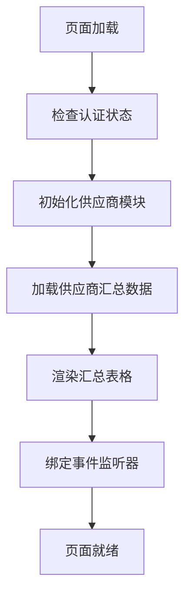
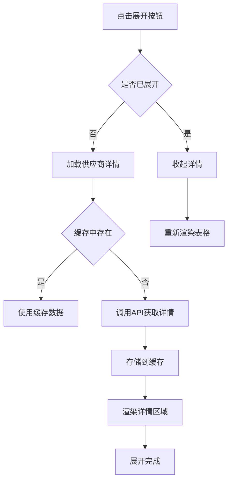
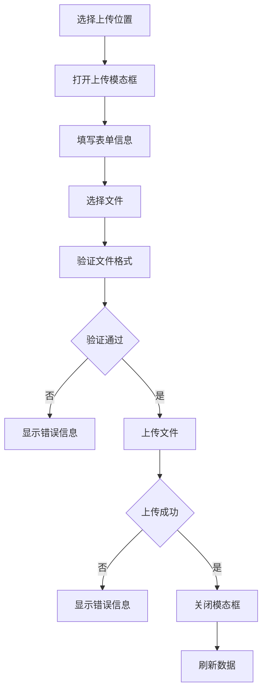

# 供应商资料管理模块界面详细介绍

> **AI编程组长指南**: 本文档详细描述SQE数据分析助手供应商资料管理模块的完整界面结构、架构设计和功能实现。作为开发参考文档，帮助AI协作开发者快速理解项目现状。

## 📋 项目概览

### 系统名称
SQE 供应商管理系统 v2.0

### 模块定位
供应商资料管理模块是系统的核心功能模块之一，负责管理供应商的各类资质文件、检测报告和认证资料。

### 技术架构
- **前端**: 原生JavaScript + CSS3 + HTML5
- **后端**: Node.js + Express + Sequelize ORM
- **数据库**: SQLite
- **文件存储**: 本地文件系统

---

## 🎨 界面整体架构

### 主界面布局图

```
┌─────────────────────────────────────────────────────────────────────────────┐
│                          SQE 供应商管理系统 v2.0                              │
├─────────────────────────────────────────────────────────────────────────────┤
│  ┌───────────────┐  ┌─────────────────────────────────────────────────────┐  │
│  │               │  │                  顶部工具栏                          │  │
│  │               │  │  供应商资料管理                    [🔄] [🔄]        │  │
│  │   侧边栏导航   │  ├─────────────────────────────────────────────────────┤  │
│  │               │  │                                                         │  │
│  │ • 工作台       │  │  ┌─────────────────────────────────────────────────┐  │  │
│  │ • IQC质量分析  │  │  │              搜索和筛选区域                      │  │  │
│  │ • 供应商资料管理│  │  │  🔍 [搜索供应商名称...]  [📊状态筛选] [📄资料筛选] │  │  │
│  │ • 月度绩效评价  │  │  └─────────────────────────────────────────────────┘  │  │
│  │               │  │                                                         │  │
│  │               │  │  ┌─────────────────────────────────────────────────┐  │  │
│  │               │  │  │              供应商汇总表格                      │  │  │
│  │               │  │  │  ┌─────┬─────┬─────┬─────┬─────┬─────┬─────┬─────┐ │  │
│  │               │  │  │  │供应商│   MSDS   │   质量协议   │  ROHS  │ REACH │  HF  │物料 │操作 │ │  │
│  │               │  │  │  │名称  │  🟢永久   │   🟢永久    │ ⚠️5份 │ ✅8份 │ ❌0份│数量 │     │ │  │
│  │               │  │  │  ├─────┼──────────┼─────────────┼────────┼───────┼──────┼─────┼─────┤ │  │
│  │               │  │  │  │🏢晶蓝│  🟢永久   │   🟢永久    │ ⚠️5份 │ ✅8份 │ ❌0份│12个 │[📂]│ │  │
│  │               │  │  │  │🏢光电│  状态显示  │   状态显示   │ 统计  │ 统计  │ 统计 │     │展开│ │  │
│  │               │  │  │  └─────┴─────┴─────┴─────┴─────┴─────┴─────┴─────┘ │  │
│  │               │  │  │  ┌───────── 资料状态堆叠柱状图示例 ─────────┐      │  │
│  │               │  │  │  │ 第一行: [🟢55.6%][🟡11.1%][🟠22.2%][🔴11.1%] │      │  │
│  │               │  │  │  │ 第二行: 5/9 (55.6%) 🟢5🟡1🔴2🔴1           │      │  │
│  │               │  │  │  └─────────────────────────────────────────────┘      │  │
│  └───────────────┘  │                                                         │  │
│                     │  ┌─────────────────────────────────────────────────┐  │  │
│                     │  │              展开详情区域                        │  │  │
│                     │  │  ┌─ 📋 通用资料 ────────────────────────────────┐ │  │
│                     │  │  │ [📧批量邮件] [📤上传] [⚙️资料类型设置]          │ │  │
│                     │  │  │ • 🟢 质量保证协议 - 永久有效         [📧✏️🗑️📁] │ │  │
│                     │  │  │ • 🟡 MSDS安全数据表 - 剩余30天      [📧✏️🗑️📁] │ │  │
│                     │  │  └─────────────────────────────────────────────┘ │  │
│                     │  │  ┌─ 🏭 检测报告 ────────────────────────────────┐ │  │
│                     │  │  │ [➕新增物料]                                 │ │  │
│                     │  │  │ ┌─ 📦 物料：PCB板 ────────────────────────┐ │ │  │
│                     │  │  │ │ [📧批量邮件] [📤上传资料] [🗑️删除物料]    │ │  │
│                     │  │  │ │ ├─ 🎯 本体检测                           │ │  │
│                     │  │  │ │ │ • 🟢 ROHS证书 - 剩余60天 [📧✏️🗑️📁]  │ │  │
│                     │  │  │ │ └─ 🔗 引用检测                           │ │  │
│                     │  │  │ │   ├─ 🧪 构成A：铜箔                      │ │  │
│                     │  │  │ │   │ • 🟡 REACH证书 - 剩余15天 [📧✏️🗑️📁]│ │  │
│                     │  │  │ │   └─ 🧪 构成B：树脂                      │ │  │
│                     │  │  │ │     • 🔴 HF证书 - 已过期5天 [📧✏️🗑️📁] │ │  │
│                     │  │  │ └─────────────────────────────────────────┘ │ │  │
│                     │  │  └─────────────────────────────────────────────┘ │  │
│                     │  └─────────────────────────────────────────────────┘  │  │
│                     └─────────────────────────────────────────────────────┘  │
└─────────────────────────────────────────────────────────────────────────────┘
```

---

## 🏗️ 系统架构层次

### 1. 前端架构 (Frontend)

#### 1.1 模块化文件组织
```
public/js/modules/supplier/
├── supplier.js                    # 主控制器 (v3.1)
├── services/
│   ├── supplier-services.js       # API服务封装
│   ├── document-type-service.js   # 文档类型服务
│   └── document-type-config.js    # 文档类型配置
└── ui/
    ├── modal-manager.js           # 统一弹窗管理器
    ├── document-type-settings-ui.js  # 文档类型设置UI
    ├── document-type-simple-ui.js    # 简化文档类型UI
    └── ui-utils.js                # UI工具函数
```

#### 1.2 CSS样式架构
```
public/css/modules/
├── supplier-table.css             # 表格样式
├── supplier-modal.css             # 基础模态框样式
├── supplier-modal-enhanced.css    # 增强模态框样式
├── supplier-modals-unified.css    # 统一弹窗样式 (BEM规范)
├── supplier-interactions.css      # 交互动画
├── supplier-status-badges.css     # 状态徽章
├── supplier-progress-bar.css      # 堆叠柱状图样式 (2025-12-18新增)
├── supplier-animations.css        # 动画效果样式
└── document-type-settings.css     # 文档类型设置样式
```

### 2. 后端架构 (Backend)

#### 2.1 API路由层
```
server/routes/
├── suppliers-summary.js           # 供应商汇总API
├── suppliers.js                   # 供应商CRUD API
├── documents-upload.js            # 文档上传API
├── materials.js                   # 物料管理API
└── document-types.js              # 文档类型管理API
```

#### 2.2 数据模型层
```
server/models/
├── Supplier.js                    # 供应商基础信息
├── SupplierDocument.js            # 供应商文档
├── Material.js                    # 物料信息
└── MaterialComponent.js           # 物料构成
```

---

## 📊 详细界面组件说明

### 1. 顶部操作区域

#### 1.1 模块标题栏
```html
<div class="module-header">
  <h3>供应商资料管理</h3>
  <div class="module-actions">
    <button class="btn btn-success" id="importBtn">
      <span class="btn-icon">🔄</span>
      同步供应商
    </button>
    <button class="btn btn-secondary" id="refreshBtn">
      <span class="btn-icon">🔄</span>
      刷新
    </button>
  </div>
</div>
```

**功能说明**:
- **同步供应商** (`importBtn`): 从IQC模块同步供应商数据，创建文件夹结构
- **刷新** (`refreshBtn`): 刷新当前显示的数据，保持展开状态

#### 1.2 搜索筛选区域
```html
<div class="supplier-controls">
  <div class="search-section">
    <input type="text" id="supplierSearch" placeholder="搜索供应商名称..."
           value="${this.searchKeyword}" class="search-input">
    <button onclick="supplierManager.clearSearch()" class="clear-search-btn">✕</button>
  </div>
  <div class="filter-section">
    <select id="statusFilter" onchange="supplierManager.filterByStatus()" class="filter-select">
      <option value="">全部状态</option>
      <option value="normal">🟢 正常</option>
      <option value="warning">🟡 即将到期</option>
      <option value="urgent">🔴 紧急</option>
      <option value="expired">❌ 已过期</option>
    </select>
    <select id="documentFilter" onchange="supplierManager.filterByDocument()" class="filter-select">
      <option value="">全部资料</option>
      <option value="missing_msds">缺失MSDS</option>
      <option value="missing_qa">缺失质量协议</option>
      <option value="missing_rohs">缺失ROHS</option>
      <option value="missing_reach">缺失REACH</option>
      <option value="missing_hf">缺失HF</option>
    </select>
  </div>
</div>
```

**功能说明**:
- **搜索框**: 实时搜索供应商名称，支持防抖(300ms)
- **状态筛选**: 按文档到期状态筛选供应商
- **资料筛选**: 按缺失的资料类型筛选供应商

### 2. 供应商汇总表格

#### 2.1 表头结构
```html
<table class="supplier-table">
  <thead>
    <tr>
      <th>供应商</th>
      <th>MSDS</th>
      <th>质量协议</th>
      <th>ROHS</th>
      <th>REACH</th>
      <th>HF</th>
      <th>物料</th>
      <th>操作</th>
    </tr>
  </thead>
</table>
```

#### 2.2 数据行渲染逻辑
每个供应商行显示：
- **供应商名称**: 🏢 点击可查看详情，居中显示，配有蓝色建筑图标
- **MSDS状态**: 显示到期时间和状态图标（仅状态预览，无操作按钮）
- **质量协议状态**: 显示到期时间和状态图标（仅状态预览，无操作按钮）
- **ROHS/REACH/HF统计**: 显示份数和最差状态（仅统计信息，无操作按钮）
- **物料数量**: 该供应商的物料总数，居中显示
- **展开/收起按钮**: 📂 展开 / 📁 收起，居中显示

**图标说明**:
- 🏢 **建筑图标**: 使用 Font Awesome `far fa-building` 图标（线条样式），蓝色(#3b82f6)，1.6倍大小，象征供应商的企业实体
- **供应商名称**: 字体大小1.1em，字重600，与图标形成良好的视觉平衡

**重要说明**:
- 汇总表格仅提供**状态预览**功能，不包含邮件、编辑等操作按钮
- 所有操作功能（邮件发送、文档编辑、删除、上传等）都在**展开后的详情区域**中实现
- 这样的设计避免表格过于臃肿，保持界面简洁清晰

#### 2.3 堆叠柱状图显示状态（2025-12-18新增）
**资料状态列采用横向堆叠柱状图显示，实现🟢+🟡+🔴+🟠+⚪=100%的视觉化展示**

**双行布局结构**:
```
第一行: [🟢55.6%][🟡11.1%][🟠22.2%][🔴11.1%] - 横向堆叠柱状图
第二行: 5/9 (55.6%) 🟢5🟡1🟠2🔴1 - 详细统计信息（适中字体）
```

**堆叠柱状图特性**:
- **动态百分比计算**: 基于实际文档状态统计，确保总和为100%
- **颜色对应系统**:
  - 🟢 绿色(#22c55e) - 正常状态
  - 🟡 黄色(#f59e0b) - 警告状态(30天内)
  - 🟠 橙色(#f97316) - 紧急状态(15天内)
  - 🔴 红色(#ef4444) - 严重状态(7天内)
  - ⚪ 灰色(#6b7280) - 已过期状态
- **交互效果**: hover时堆叠段变亮放大(scaleY 1.2)，显示tooltip详情
- **响应式设计**: 自适应不同屏幕尺寸，占满整个资料状态列宽度

**技术实现**:
```javascript
// 堆叠柱状图渲染逻辑
renderProgressBar(progressData) {
  const { totalDocuments, statusStats } = progressData;
  const totalCount = Object.values(statusStats).reduce((sum, count) => sum + count, 0);

  let currentPosition = 0;
  const stackSegments = statusConfig
    .filter(({ key }) => statusStats[key] > 0)
    .map(({ key, color, label }) => {
      const percentage = (statusStats[key] / totalCount * 100).toFixed(1);
      const leftPosition = currentPosition;
      currentPosition += parseFloat(percentage);

      return `
        <div class="supplier-progress__stack-segment"
             style="left: ${leftPosition}%; width: ${percentage}%; background-color: ${color};"
             title="${label}: ${statusStats[key]} (${percentage}%)">
        </div>
      `;
    }).join('');
}
```

**用户体验优化**:
- **直观可视化**: 一目了然看到每个供应商的文档状态分布
- **空间利用**: 双行布局充分利用表格空间，信息层次清晰
- **快速识别**: 通过颜色和长度快速判断供应商资料整体健康状况
- **详细统计**: 第二行提供精确的数量和百分比信息（大号字体增强可读性）
- **字体优化**: 统计信息字体1.1em，状态图标1.2em，适中的视觉层次

#### 2.4 状态显示规则
```javascript
// 状态优先级和显示逻辑（4层体系）
const statusPriority = {
  'normal': 1,      // 🟢 正常
  'warning': 2,     // 🟡 警告(15-30天)
  'urgent': 3,      // 🟠 紧急(<15天)
  'expired': 4      // 🔴 已过期(<0天)
};

// 计算剩余天数
let daysUntilExpiry = Math.ceil((new Date(expiryDate) - new Date()) / (1000 * 60 * 60 * 24));

// 状态判断逻辑
if (daysUntilExpiry < 0) warningLevel = 'expired';
else if (daysUntilExpiry <= 7) warningLevel = 'critical';
else if (daysUntilExpiry <= 15) warningLevel = 'urgent';
else if (daysUntilExpiry <= 30) warningLevel = 'warning';
```

### 3. 展开详情区域

#### 3.1 详情区域结构
每个供应商展开后显示：
- **通用资料区域**: 显示供应商级别的通用文档（带 ⓘ 提示图标）
- **检测报告区域**: 按物料分组显示检测报告和构成信息（带 ⓘ 提示图标）

#### 3.2 资料分类定义

**📋 通用资料定义：**
适用于所有物料的资质文件，不针对特定物料，而是供应商整体的资质证明：
- 质量保证协议(QA Agreement)
- MSDS安全数据表
- ISO质量体系认证
- 企业资质证书
- 营业执照等

**🏭 检测报告定义：**
针对特定物料的检测和认证文件，与具体物料一一对应，确保物料符合技术要求：
- 本体检测：材料成分、性能等检测报告
- 构成检测：零部件构成明细表
- ROHS/REACH环保认证
- HF有害物质检测
- 物料规格书等

#### 3.3 通用资料区域
```html
<div class="details-section">
  <div class="section-header">
    <h4>📋 通用资料</h4>
    <div class="section-actions">
      <button class="email-btn batch-email-btn" data-type="common"
              data-supplier-id="${supplierId}" title="批量邮件通知">
        📧 批量邮件
      </button>
      <button class="upload-btn" data-type="common"
              data-supplier-id="${supplierId}" title="上传通用资料">
        📤 上传
      </button>
      <button class="settings-btn document-type-settings-btn"
              data-type="common" title="资料类型设置">
        ⚙️ 资料类型设置
      </button>
    </div>
  </div>
  <!-- 文档列表 -->
  <ul class="document-list">
    <li class="document-item ${doc.status}">
      <span class="doc-icon">${window.supplierServices.getStatusIcon(doc.status)}</span>
      <span class="doc-type">${window.supplierServices.getCertificateTypeTextSync(doc.documentType)}</span>
      <span class="doc-name">${doc.documentName}</span>
      <span class="doc-expiry">
        ${doc.isPermanent ? '永久有效' : `到期: ${window.supplierServices.formatDate(doc.expiryDate)}`}
      </span>
      <div class="doc-actions">
        <button class="action-btn email-btn single-email-btn"
                data-document-id="${doc.id}" title="发送邮件">📧</button>
        <button class="action-btn edit-btn"
                data-document-id="${doc.id}" title="编辑">✏️</button>
        <button class="action-btn delete-btn"
                data-document-id="${doc.id}" title="删除">🗑️</button>
        <button class="action-btn folder-btn"
                data-file-path="${doc.filePath}" title="打开文件夹">📁</button>
      </div>
    </li>
  </ul>
</div>
```

**功能按钮说明**:
- **📧 批量邮件**: 生成该供应商所有即将到期通用资料的邮件通知
- **📤 上传**: 打开上传模态框，上传新的通用资料
- **⚙️ 资料类型设置**: 管理文档类型，可添加/编辑/删除自定义类型

#### 3.2 检测报告区域
```html
<div class="details-section">
  <div class="section-header">
    <h4>🏭 检测报告</h4>
    <div class="section-actions">
      <button class="add-material-btn" data-supplier-id="${supplierId}" title="新增物料">
        ➕ 新增物料
      </button>
    </div>
  </div>
  <div class="materials-container">
    <!-- 物料列表 -->
    <div class="material-section">
      <div class="material-header">
        <h5>📦 物料：${material.materialName}</h5>
        <div class="material-actions">
          <button class="email-btn batch-email-btn" data-type="material"
                  data-supplier-id="${supplierId}" data-material-id="${material.materialId}"
                  title="批量邮件通知">📧 批量邮件</button>
          <button class="upload-btn" data-type="material"
                  data-supplier-id="${supplierId}" data-material-id="${material.materialId}"
                  title="上传物料资料">📤 上传资料</button>
          <button class="action-btn delete-material-btn"
                  data-supplier-id="${supplierId}" data-material-id="${material.materialId}"
                  title="删除物料">🗑️ 删除物料</button>
        </div>
      </div>

      <!-- 本体检测文档 -->
      <div class="detection-section">
        <h6 class="detection-title">🎯 本体检测</h6>
        <ul class="document-list">
          <!-- 文档项列表 -->
        </ul>
      </div>

      <!-- 引用检测构成 -->
      <div class="detection-section">
        <h6 class="detection-title">🔗 引用检测</h6>
        <div class="component-section">
          <h7 class="component-title">🧪 ${componentName}</h7>
          <ul class="document-list">
            <!-- 构成文档列表 -->
          </ul>
        </div>
      </div>
    </div>
  </div>
</div>
```

**检测类型说明**:
- **🎯 本体检测**: 检测对象是供应商交付的物料本身
- **🔗 引用检测**: 检测对象是上游材料/零件的检测报告

---

## 🔧 核心功能模块

### 1. 文档上传功能

#### 1.1 上传模态框结构
```html
<div id="uploadModal" class="supplier-modal supplier-modal--upload">
  <div class="supplier-modal__content">
    <div class="supplier-modal__header">
      <h3 class="supplier-modal__title">上传资料</h3>
      <button class="supplier-modal__close upload-modal-close">&times;</button>
    </div>
    <div class="supplier-modal__body">
      <form id="uploadForm">
        <!-- 供应商信息 -->
        <div class="supplier-form__group">
          <label class="supplier-form__label">供应商</label>
          <input type="text" id="uploadSupplierName" readonly>
        </div>

        <!-- 物料信息 (仅物料资料时显示) -->
        <div class="form-group" id="materialGroup">
          <label>物料</label>
          <input type="text" id="uploadMaterialName" readonly>
        </div>

        <!-- 检测类型选择 -->
        <div class="form-group" id="detectionTypeGroup">
          <label>🎯 检测类型</label>
          <div class="detection-type-options">
            <div class="detection-type-option">
              <label>
                <input type="radio" name="detectionType" value="direct" checked>
                <span>本体检测</span>
              </label>
              <small>检测对象是供应商交付的物料本身</small>
            </div>
            <div class="detection-type-option">
              <label>
                <input type="radio" name="detectionType" value="referenced">
                <span>引用检测</span>
              </label>
              <small>检测对象是上游材料/零件的检测报告</small>
            </div>
          </div>
        </div>

        <!-- 构成选择 (引用检测时显示) -->
        <div class="form-group" id="componentGroup">
          <label>🧪 选择构成</label>
          <select id="componentSelect" class="component-select">
            <option value="">请选择构成</option>
          </select>
          <button type="button" id="openComponentManagementBtn" class="add-component-btn">
            ➕ 添加新构成
          </button>
        </div>

        <!-- 资料类型 -->
        <div class="form-group">
          <label>资料类型</label>
          <select id="documentType" required>
            <option value="">请选择</option>
            <!-- 动态加载资料类型 -->
          </select>
        </div>

        <!-- 文件上传区域 -->
        <div class="form-group">
          <label>选择文件</label>
          <div class="upload-drop-zone" id="uploadDropZone">
            <div class="upload-icon">📁</div>
            <p>拖拽文件到此处或点击选择</p>
            <input type="file" id="fileInput" accept=".pdf,.xlsx,.xls,.doc,.docx" style="display: none;">
          </div>
          <div id="filePreview" class="file-preview">
            <span class="file-name"></span>
            <button type="button" class="remove-file" onclick="supplierManager.removeSelectedFile()">&times;</button>
          </div>
        </div>

        <!-- 到期日期 -->
        <div class="form-group">
          <label>
            <input type="checkbox" id="isPermanent" onchange="supplierManager.togglePermanentDate()">
            永久有效
          </label>
          <input type="date" id="expiryDate" class="expiry-date">
        </div>

        <!-- 备注 -->
        <div class="form-group">
          <label>备注</label>
          <textarea id="documentRemark" rows="3" placeholder="请输入备注信息"></textarea>
        </div>
      </form>
    </div>
    <div class="modal-footer">
      <button type="button" class="btn btn-secondary upload-cancel-btn">取消</button>
      <button type="button" class="btn btn-primary upload-submit-btn">上传</button>
    </div>
  </div>
</div>
```

#### 1.2 上传流程
1. **选择上传位置**: 通用资料 / 物料资料
2. **填写基本信息**: 选择资料类型、检测类型、构成等
3. **上传文件**: 支持拖拽上传，限制10MB
4. **设置到期日期**: 可选择永久有效或设置具体日期
5. **提交上传**: 调用`/api/documents/upload`接口

### 2. 邮件通知功能

#### 2.1 单个邮件生成
```javascript
async generateSingleEmail(documentId, supplierId) {
  // 1. 获取供应商和文档信息
  // 2. 准备邮件变量
  const variables = {
    供应商名称: supplier.supplierName,
    物料名称: targetDoc.materialName || '',
    具体构成名称: targetDoc.componentName || '',
    证书类型: certificateTypeText,
    到期日期: targetDoc.isPermanent ? '永久有效' : window.supplierServices.formatDate(targetDoc.expiryDate),
    剩余天数: targetDoc.isPermanent ? '永久有效' : `${targetDoc.daysUntilExpiry}天`,
    SQE工程师联系方式: 'SQE团队'
  };

  // 3. 生成邮件内容
  const template = window.supplierServices.getEmailTemplate();
  const emailContent = window.supplierServices.replaceEmailVariables(template, variables);

  // 4. 显示邮件预览模态框
  window.supplierUIUtils.showEmailModal(subject, emailContent);
}
```

#### 2.2 批量邮件生成
- 收集所有即将到期的文档(30天内或已过期)
- 按证书类型分组汇总
- 生成统一的邮件通知内容
- 支持复制到剪贴板功能

#### 2.3 📧 邮件状态标识规范（2025-12-19最新修正）
批量邮件中的状态标识符号与系统UI完全一致，确保用户体验统一：

| 天数范围 | 后端status | 邮件标识 | 说明 |
|---------|-----------|----------|------|
| < 0     | expired   | 🔴       | 已过期 |
| < 15    | urgent    | 🟠       | 紧急 |
| 15-30   | warning   | 🟡       | 警告 |
| 16-30   | warning   | 🟡       | 30天内警告 |
| >30     | normal   | 🟢       | 正常（不出现） |

**修正要点**：
- ✅ 使用系统 `getStatusIcon()` 的标准映射
- ✅ 已过期资料使用 ❌ 而非 🔴，与UI显示一致
- ✅ critical 和 urgent 都使用 🔴，warning 使用 🟡
- ✅ 邮件只显示 ≤30天或已过期的资料，正常状态不出现

**🎯 系统状态图标映射（4层标准）**：
```javascript
// 来自 supplier-services.js 的 getStatusIcon() 方法（已修正）
const map = {
  normal: '🟢',     // 正常 - 绿色 (#22c55e)
  warning: '🟡',    // 警告 - 黄色 (#f59e0b)
  urgent: '🟠',     // 紧急 - 橙色 (#f97316)
  expired: '🔴'     // 已过期 - 红色 (#ef4444)
};
```

**统一性保证**：
- ✅ 所有前端显示使用此映射
- ✅ 邮件通知使用此映射
- ✅ 堆叠柱状图使用此映射
- ✅ 状态筛选器使用此映射
- ❌ 移除所有 critical 相关引用

### 3. 文档类型管理

#### 3.1 预设文档类型
```json
[
  {
    "id": "doc_type_001",
    "name": "质量保证协议",
    "category": "common",
    "isRequired": true,
    "isSystemDefault": true
  },
  {
    "id": "doc_type_002",
    "name": "MSDS安全数据表",
    "category": "common",
    "isRequired": true,
    "isSystemDefault": true
  },
  {
    "id": "doc_type_101",
    "name": "ROHS证书",
    "category": "material",
    "isRequired": true,
    "isSystemDefault": true
  }
]
```

#### 3.2 动态类型管理
- 支持添加自定义文档类型
- 可编辑类型名称和描述
- 支持禁用/启用类型
- 按类别分组(通用/物料)

---

## 📱 数据库设计

### 1. 核心表结构

#### 1.1 供应商表 (suppliers)
```sql
CREATE TABLE suppliers (
  id INTEGER PRIMARY KEY AUTOINCREMENT,
  code STRING,                    -- 供应商编码
  name STRING NOT NULL UNIQUE,    -- 供应商名称
  contact_person STRING,          -- 联系人
  contact_email STRING,           -- 联系邮箱
  contact_phone STRING,           -- 联系电话
  level ENUM('Strategic', 'Core', 'General', 'Eliminated'),  -- 供应商等级
  status ENUM('Active', 'Inactive', 'Blacklisted'),          -- 状态
  address STRING,                 -- 地址
  notes TEXT                      -- 备注
);
```

#### 1.2 物料表 (materials)
```sql
CREATE TABLE materials (
  id INTEGER PRIMARY KEY AUTOINCREMENT,
  supplier_id INTEGER NOT NULL,   -- 所属供应商
  material_name STRING NOT NULL,  -- 物料名称
  material_code STRING,           -- 物料编码
  description TEXT,               -- 物料描述
  status ENUM('Active', 'Inactive') DEFAULT 'Active',
  FOREIGN KEY (supplier_id) REFERENCES suppliers(id)
);
```

#### 1.3 物料构成表 (material_components)
```sql
CREATE TABLE material_components (
  id INTEGER PRIMARY KEY AUTOINCREMENT,
  material_id INTEGER NOT NULL,   -- 所属物料
  component_name STRING NOT NULL, -- 构成名称
  component_code STRING,          -- 构成编码
  description TEXT,               -- 构成描述
  status ENUM('Active', 'Inactive') DEFAULT 'Active',
  FOREIGN KEY (material_id) REFERENCES materials(id)
);
```

#### 1.4 供应商文档表 (supplier_documents)
```sql
CREATE TABLE supplier_documents (
  id INTEGER PRIMARY KEY AUTOINCREMENT,
  supplier_id INTEGER,            -- 供应商ID(通用资料)
  material_id INTEGER,            -- 物料ID(物料资料)
  component_id INTEGER,           -- 构成ID(引用检测)
  document_type STRING NOT NULL,  -- 文档类型
  document_name STRING NOT NULL,  -- 文档名称
  file_path STRING,               -- 文件路径
  expiry_date DATE,               -- 到期日期
  is_permanent BOOLEAN DEFAULT 0, -- 是否永久有效
  detection_type ENUM('direct', 'referenced'), -- 检测类型
  level ENUM('supplier', 'material', 'component'), -- 文档层级
  status ENUM('active', 'inactive') DEFAULT 'active',
  is_current BOOLEAN DEFAULT 1,   -- 是否当前版本
  remarks TEXT,                   -- 备注
  created_at DATETIME DEFAULT CURRENT_TIMESTAMP,
  updated_at DATETIME DEFAULT CURRENT_TIMESTAMP
);
```

### 2. 数据流架构

```
前端请求 → API路由 → 业务逻辑 → 数据查询 → 数据库
    ↓           ↓          ↓          ↓         ↓
  用户操作   HTTP请求   数据处理   SQL执行   数据存储
    ↓           ↓          ↓          ↓         ↓
  界面更新   JSON响应   业务验证   ORM映射   持久化
```

---

## 🎯 交互逻辑详解

### 1. 页面加载流程



### 2. 展开/收起详情流程



### 3. 文件上传流程



---

## 🔔 状态管理

### 1. 🎯 文档状态分类标准（4层体系）

| 状态 | 条件 | 图标 | 颜色值 | 说明 |
|------|------|------|--------|------|
| **normal** | 30天以上（含永久） | 🟢 | #22c55e | 正常 |
| **warning** | 15-30天 | 🟡 | #f59e0b | 警告 |
| **urgent** | <15天 | 🟠 | #f97316 | 紧急 |
| **expired** | 过期（<0天） | 🔴 | #ef4444 | 已过期 |
| **permanent** | isPermanent = true | 🟢 | #22c55e | 永久有效 |

### 2. 🎨 颜色系统设计

#### 主色调定义
```css
:root {
  --status-normal: #22c55e;      /* 成功绿 */
  --status-warning: #f59e0b;      /* 警告黄 */
  --status-urgent: #f97316;       /* 紧急橙 */
  --status-expired: #ef4444;      /* 过期红 */
}
```

#### 渐变效果
- **正常状态**: `linear-gradient(135deg, #22c55e 0%, #16a34a 50%, #15803d 100%)`
- **警告状态**: `linear-gradient(135deg, #f59e0b 0%, #d97706 50%, #b45309 100%)`
- **紧急状态**: `linear-gradient(135deg, #f97316 0%, #ea580c 50%, #dc2626 100%)`
- **过期状态**: `linear-gradient(135deg, #ef4444 0%, #dc2626 50%, #b91c1c 100%)`

### 3. 🏗️ 技术架构统一

#### DocumentStatusService 统一服务
```javascript
// 核心状态计算逻辑
static calculateDocumentStatus(expiryDate, isPermanent = false) {
    let daysUntilExpiry = null;
    let status = 'normal';

    if (!isPermanent && expiryDate) {
        const expiry = new Date(expiryDate);
        const today = new Date(now.getFullYear(), now.getMonth(), now.getDate());
        const expiryDay = new Date(expiry.getFullYear(), expiry.getMonth(), expiry.getDate());

        daysUntilExpiry = Math.ceil((expiryDay - today) / (1000 * 60 * 60 * 24));

        if (daysUntilExpiry < 0) {
            status = 'expired';
        } else if (daysUntilExpiry <= 15) {
            status = 'urgent';
        } else if (daysUntilExpiry <= 30) {
            status = 'warning';
        }
    }

    return { status, daysUntilExpiry, isExpired, isUrgent, isWarning, isNormal };
}
```

### 4. 📊 堆叠柱状图显示规范

#### 显示格式
- **第一行**: 渐变色柱状图（按比例显示）
- **第二行**: 统计信息 + 状态图标组合

#### 示例
```
🟢🟡🟠🔴 柱状图 (100% 宽度)
6/11 (54.5%) 🟢6🟡1🟠4🔴0
```

#### 图标映射
```javascript
const iconMap = {
    normal: '🟢',
    warning: '🟡',
    urgent: '🟠',
    expired: '🔴'
};
```

### 5. 缓存策略

```javascript
// 详情数据缓存
this.detailsCache = {};

// 智能缓存策略
async loadDetails(supplierId) {
  // 1. 检查缓存
  if (this.detailsCache[supplierId]) {
    return this.detailsCache[supplierId];
  }

  // 2. 加载数据
  const details = await api.getSupplierDetails(supplierId);

  // 3. 存储缓存
  this.detailsCache[supplierId] = details;

  // 4. 设置5-10分钟过期
  setTimeout(() => {
    delete this.detailsCache[supplierId];
  }, 5 * 60 * 1000);
}
```

---

## 🛠️ 技术特性

### 1. 性能优化

#### 1.1 虚拟滚动
- 大量供应商时启用虚拟滚动
- 只渲染可视区域内的行
- 提升页面响应速度

#### 1.2 防抖搜索
```javascript
// 搜索防抖(300ms)
searchInput.oninput = (e) => {
  clearTimeout(searchTimeout);
  searchTimeout = setTimeout(() => {
    this.searchKeyword = e.target.value.trim();
    this.render();
  }, 300);
};
```

#### 1.3 智能缓存
- 详情数据缓存5-10分钟
- 避免重复API调用
- 刷新时智能清除相关缓存

### 2. 用户体验

#### 2.1 拖拽上传
- 支持文件拖拽上传
- 实时预览文件信息
- 上传进度显示

#### 2.2 键盘导航
- Tab键切换表单元素
- Enter键确认操作
- Escape键关闭模态框

#### 2.3 响应式设计
- 移动端适配
- 触摸手势支持
- 自适应布局

### 3. 错误处理

#### 3.1 网络异常
- 自动重试机制
- 离线状态提示
- 数据同步恢复

#### 3.2 文件上传异常
- 文件大小限制(10MB)
- 格式验证(PDF/Excel/Word)
- 上传失败重试

---

## 📚 API接口文档

### 1. 供应商汇总接口

**GET** `/api/suppliers/summary`

**响应示例**:
```json
{
  "success": true,
  "data": [
    {
      "supplierId": 1,
      "supplierName": "晶蓝光电",
      "materialCount": 12,
      "commonDocuments": {
        "environmental_msds": {
          "documentName": "MSDS安全数据表",
          "expiryDate": "2025-12-31",
          "daysUntilExpiry": 30,
          "isPermanent": false,
          "status": "warning"
        }
      },
      "materialDocuments": {
        "rohs": { "count": 5, "worstStatus": "normal" },
        "reach": { "count": 8, "worstStatus": "warning" },
        "hf": { "count": 0, "worstStatus": "normal" }
      }
    }
  ]
}
```

### 2. 供应商详情接口

**GET** `/api/suppliers/:id/details`

**响应示例**:
```json
{
  "success": true,
  "data": {
    "supplierId": 1,
    "supplierName": "晶蓝光电",
    "commonDocuments": [
      {
        "id": 1,
        "documentType": "environmental_msds",
        "documentName": "MSDS安全数据表",
        "expiryDate": "2025-12-31",
        "daysUntilExpiry": 30,
        "isPermanent": false,
        "status": "warning",
        "filePath": "D:/资料档案/晶蓝/通用资料"
      }
    ],
    "materials": [
      {
        "materialId": 1,
        "materialName": "PCB板",
        "directDocuments": [
          {
            "documentId": 10,
            "documentType": "environmental_rohs",
            "documentName": "ROHS证书",
            "expiryDate": "2025-12-31",
            "daysUntilExpiry": 60,
            "isPermanent": false,
            "status": "normal"
          }
        ],
        "referencedComponents": {
          "铜箔": {
            "componentId": 1,
            "componentName": "铜箔",
            "documents": [
              {
                "documentId": 15,
                "documentType": "environmental_reach",
                "documentName": "REACH证书",
                "expiryDate": "2025-12-31",
                "daysUntilExpiry": 15,
                "isPermanent": false,
                "status": "urgent"
              }
            ]
          }
        }
      }
    ]
  }
}
```

---

## 🎨 样式规范

### 1. BEM命名规范

```css
/* 块(Block) */
.supplier-modal {}

/* 元素(Element) */
.supplier-modal__header {}
.supplier-modal__content {}
.supplier-modal__title {}

/* 修饰符(Modifier) */
.supplier-modal--upload {}
.supplier-modal--edit {}
.supplier-modal__button--primary {}
.supplier-modal__button--secondary {}
```

### 2. 色彩系统

```css
:root {
  /* 主色调 */
  --primary-color: #2563eb;
  --primary-hover: #1d4ed8;

  /* 状态色彩 */
  --success-color: #22c55e;
  --warning-color: #f59e0b;
  --danger-color: #ef4444;
  --info-color: #3b82f6;

  /* 文档状态色彩 */
  --status-normal: #22c55e;
  --status-warning: #f59e0b;
  --status-urgent: #f97316;
  --status-critical: #ef4444;
  --status-expired: #991b1b;
}
```

---

## 🔮 未来优化方向

### 1. 功能增强
- [ ] 批量操作优化
- [ ] 高级搜索功能
- [ ] 数据导入导出
- [ ] 审批工作流

### 2. 性能提升
- [ ] 离线数据缓存
- [ ] 数据分页加载
- [ ] 图片懒加载
- [ ] 服务端渲染

### 3. 用户体验
- [ ] 快捷键支持
- [ ] 拖拽排序
- [ ] 多语言支持
- [ ] 主题切换

---

## 📞 联系信息

**文档维护**: AI编程团队
**最后更新**: 2025-12-19
**版本**: v3.5 (🎯 统一4层状态标准 - 移除critical，优化颜色体系)

---

## 📋 版本更新记录

### v3.5 (2025-12-19) - 🎯 状态标准重构
- **重大更新**: 统一采用4层状态分类标准
- **移除critical**: 彻底移除critical状态，避免混淆
- **颜色优化**: 紧急状态改为🟠橙色，过期状态改为🔴红色
- **代码统一**: 修复所有后端路由文件的状态计算逻辑
- **文档同步**: 更新所有状态管理相关文档

### v3.4 (2025-12-18) - 新增资料分类提示功能
- 添加通用资料和检测报告的提示图标
- 优化提示框样式和位置
- 改进用户交互体验

### 关键技术改进
1. **DocumentStatusService**: 统一状态计算服务
2. **后端路由统一**: suppliers.js, suppliers-summary.js, documents-upload.js, suppliers-tree.js
3. **前端映射统一**: supplier.js, supplier-services.js, supplier-ui.js
4. **样式系统统一**: CSS渐变效果和颜色映射

---

> 💡 **提示**: 本文档与代码同步更新，如有疑问请参考最新代码实现。作为AI协作开发者，请严格遵循本文档的架构设计和开发规范。